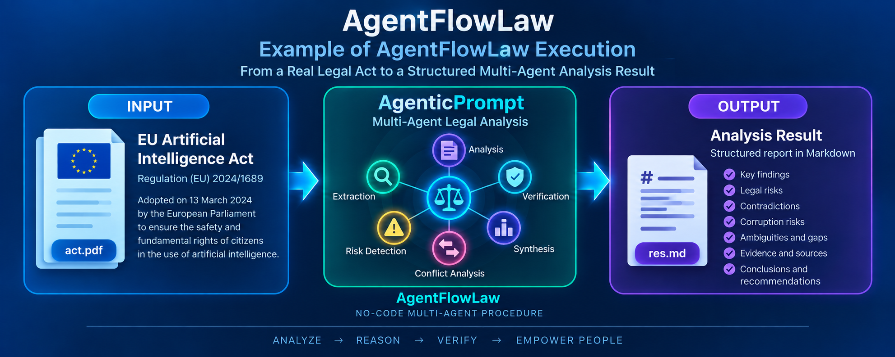

# AgentFlowLaw Example

## Analysis of the EU Artificial Intelligence Act

This directory contains a practical example of applying **AgentFlowLaw**
to the analysis of a real legal act.

The example demonstrates the complete workflow from a legal document to
a structured analytical result:

``` text
EU Artificial Intelligence Act
          ↓
        act.pdf
          ↓
    AgenticPrompt
          ↓
  Multi-Agent Analysis
          ↓
        res.md
```

------------------------------------------------------------------------

## Input Legal Act

The input document is the **Artificial Intelligence Act (AI Act)** ---
**Regulation (EU) 2024/1689**, which establishes harmonised rules on
artificial intelligence in the European Union.

The European Parliament adopted the Artificial Intelligence Act on **13
March 2024**. The final Regulation (EU) 2024/1689 of the European
Parliament and of the Council is dated **13 June 2024**.

The Act establishes a common regulatory framework for artificial
intelligence and is aimed at promoting trustworthy AI while addressing
risks to health, safety, and fundamental rights.

The legal act used in this example is available here:

### [→ Open act.pdf](act.pdf)

------------------------------------------------------------------------

## Analysis Procedure

The document is analyzed using the **AgenticPrompt** generated by
AgentFlowLaw.

The AgenticPrompt represents a structured no-code multi-agent procedure
rather than a single direct request to an LLM.

In this example, the analytical procedure is designed to identify and
examine:

-   legal risks;
-   potential contradictions;
-   ambiguities and gaps;
-   corruption-risk indicators;
-   relevant legal safeguards;
-   supporting evidence and sources;
-   issues requiring additional verification or human expert assessment.

The AgenticPrompt used for the analysis is available in the `PROMPTS`
directory:

### [→ Open AgenticPrompt](../PROMPTS/AgenticPrompt.md)

The original task from which this AgenticPrompt was generated is also
available:

### [→ Open PrimaryPrompt](../PROMPTS/PrimaryPrompt.md)

------------------------------------------------------------------------

## Example Workflow

The complete experiment can be represented as:

``` text
Primary Prompt
      ↓
AgentFlowLaw
      ↓
Agentic Prompt
      ↓
EU Artificial Intelligence Act
      ↓
Multi-Agent Legal Analysis
      ↓
Verification
      ↓
Structured Result
      ↓
Human Expert
```

In operational form:

``` text
act.pdf
   ↓
AgenticPrompt
   ↓
Specialized Legal Agents
   ↓
Analysis + Verification
   ↓
res.md
```

------------------------------------------------------------------------

## Result

Execution of the AgenticPrompt on the Artificial Intelligence Act
produces a structured analytical report.

The resulting report is stored in:

### [→ Open res.md](res.md)

The result contains the findings generated by the multi-agent analytical
procedure, including identified risks, potential contradictions,
ambiguities, gaps, corruption-risk indicators, safeguards, evidence, and
conclusions requiring human expert review.

The generated result should be interpreted as an **analytical output of
the AgentFlowLaw procedure**, not as an autonomous legally binding
assessment.

------------------------------------------------------------------------

## Graphical Representation

The complete experimental workflow — from the input legal act through the AgentFlowLaw-generated agentic procedure to the structured analysis result — is illustrated below.



The figure shows the practical execution chain:

**EU Artificial Intelligence Act (`act.pdf`) → AgenticPrompt → Multi-Agent Legal Analysis → Analysis Result (`res.md`)**

The input legal document is processed by the specialized agents defined in the AgenticPrompt. The agents perform extraction, risk detection, conflict analysis, verification, and synthesis. The resulting structured report is stored in [`res.md`](res.md).


------------------------------------------------------------------------

## Files

  --------------------------------------------------------------------------------------
  File                                               Description
  -------------------------------------------------- -----------------------------------
  **[act.pdf](act.pdf)**                             EU Artificial Intelligence Act used
                                                     as the input legal document

  **[PrimaryPrompt](../PROMPTS/PrimaryPrompt.md)**   Initial legal-analysis task

  **[AgenticPrompt](../PROMPTS/AgenticPrompt.md)**   Multi-agent analytical procedure
                                                     generated by AgentFlowLaw

  **[res.md](res.md)**                               Structured result obtained by
                                                     executing the AgenticPrompt
  --------------------------------------------------------------------------------------

------------------------------------------------------------------------

## Reproducibility

The example is intended to make the AgentFlowLaw workflow transparent
and reproducible.

The complete chain is preserved:

``` text
Legal Act
    ↓
Analysis Procedure
    ↓
Specialized Agents
    ↓
Verification
    ↓
Structured Result
    ↓
Human Review
```

This makes it possible to inspect not only the final analytical result
but also the procedure through which that result was obtained.

------------------------------------------------------------------------

## Core Principle

> **AgentFlowLaw does not primarily program an answer to a legal
> question; it programs the procedure for obtaining, checking, tracing,
> and presenting that answer.**

In this example:

``` text
act.pdf → AgenticPrompt → Multi-Agent Analysis → res.md → Human Expert
```

------------------------------------------------------------------------

## Authors

**Dmytro Lande**\
**Leonard Strashnoy**

**AgentFlowLaw --- Version 1.0 · 2026**
