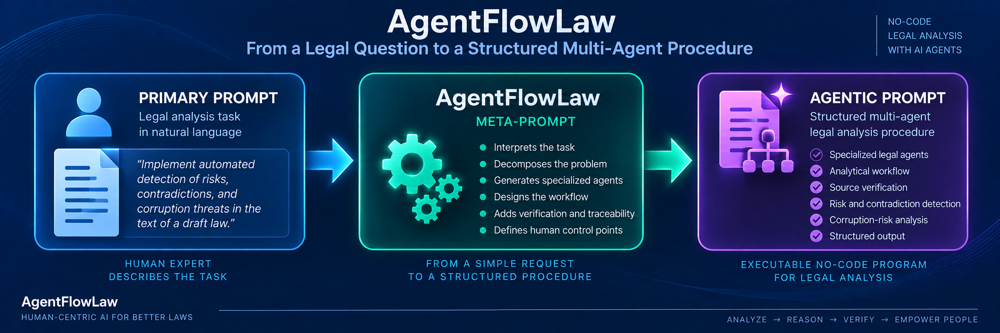

# AgentFlowLaw Prompts

This directory contains an example demonstrating how **AgentFlowLaw transforms a simple legal-analysis request into a structured multi-agent procedure**.

The example consists of two prompts:

- **[Primary Prompt](PrimaryPrompt)** — the initial legal-analysis task formulated by a human expert.
- **[Agentic Prompt](AgenticPrompt)** — the structured multi-agent procedure generated from the Primary Prompt using AgentFlowLaw.

---

## Primary Prompt

The initial task is formulated by a human expert in natural language:

> **Implement automated detection of risks, contradictions, and corruption threats in the text of a draft law.**

The complete Primary Prompt is available here:

### [→ Open PrimaryPrompt](PrimaryPrompt)

The Primary Prompt describes **what has to be analyzed**, but does not define the internal analytical procedure.

In particular, it does not explicitly specify:

- the required specialized agents;
- decomposition of the legal-analysis task;
- sequential and parallel analytical operations;
- communication between agents;
- legal-source verification;
- handling of uncertainty;
- verification of analytical results;
- traceability of conclusions;
- human-control points.

These elements are generated by **AgentFlowLaw**.

---

## From Primary Prompt to Agentic Prompt

AgentFlowLaw acts as a **meta-prompt**.

It receives the Primary Prompt as an input and transforms the original legal-analysis task into a structured no-code multi-agent procedure.

The transformation follows the general principle:

```text
Primary Prompt
      ↓
AgentFlowLaw
      ↓
Agentic Prompt
```

More specifically:

```text
┌──────────────────────────┐
│      PRIMARY PROMPT      │
│                          │
│    Legal analysis task   │
│    formulated by a       │
│    human expert          │
└────────────┬─────────────┘
             │
             ▼
┌──────────────────────────┐
│       AgentFlowLaw       │
│                          │
│        Meta-Prompt       │
│                          │
│  • Task decomposition    │
│  • Agent generation      │
│  • Workflow design       │
│  • Source verification   │
│  • Result verification   │
│  • Traceability          │
│  • Human control         │
└────────────┬─────────────┘
             │
             ▼
┌──────────────────────────┐
│      AGENTIC PROMPT      │
│                          │
│   Structured no-code     │
│   multi-agent legal      │
│   analysis procedure     │
└──────────────────────────┘
```

Thus:

> **Primary Prompt → AgentFlowLaw → Agentic Prompt**

AgentFlowLaw does not merely expand or rewrite the original prompt.

It **programs the analytical procedure** required to solve the legal task.

---

## Prompt Transformation

The transformation from the Primary Prompt into the Agentic Prompt can be represented graphically as follows:



The figure illustrates the role of AgentFlowLaw as an intermediate meta-programming layer between a human-formulated legal task and an executable multi-agent analytical procedure.

---

## Agentic Prompt

The Agentic Prompt generated using AgentFlowLaw defines a structured multi-agent procedure for performing the requested legal analysis.
The complete Agentic Prompt is available here:

### [→ Open AgenticPrompt](AgenticPrompt)

The generated procedure specifies:

- specialized legal agents;
- roles and goals of individual agents;
- inputs and outputs;
- task decomposition;
- sequential analytical operations;
- parallel analytical branches;
- information transfer between agents;
- legal-source retrieval and verification;
- detection of legal risks;
- detection of contradictions;
- detection of ambiguities and gaps;
- detection of corruption-risk indicators;
- evidence verification;
- legal reasoning;
- traceability of conclusions;
- synthesis of analytical results;
- human-control points.

---

## Agentic Analysis Workflow

After generation of the Agentic Prompt, the complete workflow can be represented as:

```text
Legal Task
    ↓
Primary Prompt
    ↓
AgentFlowLaw
    ↓
Agentic Prompt
    ↓
Multi-Agent Analysis
    ↓
Verification
    ↓
Structured Analysis Result
    ↓
Human Expert
```

The **Primary Prompt** defines the task.

**AgentFlowLaw** defines how the task should be solved.

The **Agentic Prompt** represents the generated no-code program of the analytical procedure.

The LLM or LLM-based system can then execute this procedure to obtain a structured and verifiable result.

---

## Role of AgentFlowLaw

The transformation implemented by AgentFlowLaw can be formally represented as:

```text
Primary Prompt
      ↓
Task Interpretation
      ↓
Legal Context Construction
      ↓
Task Decomposition
      ↓
Agent Generation
      ↓
Interaction Design
      ↓
Verification Design
      ↓
Agentic Prompt
```

The generated Agentic Prompt therefore contains not only instructions for legal analysis but also the architecture of the analytical process itself.

This distinguishes AgentFlowLaw from a conventional prompt-based interaction with an LLM.

---

## Core Principle

The example demonstrates the central principle of AgentFlowLaw:

> **AgentFlowLaw does not primarily program an answer to a legal question; it programs the procedure for obtaining, checking, tracing, and presenting that answer.**

In compact form:

```text
Legal Question
      ↓
Programmed Analytical Procedure
      ↓
Verified Result
      ↓
Human Decision
```

This approach transforms prompt engineering into **no-code programming of legal-analysis procedures**.

---

## Files

| File | Description |
|---|---|
| **[PrimaryPrompt](PrimaryPrompt)** | Initial legal-analysis task formulated in natural language |
| **[AgenticPrompt](AgenticPrompt)** | Structured multi-agent legal-analysis procedure generated using AgentFlowLaw |

---

## Related Framework

The full AgentFlowLaw framework is available in the repository:

### [→ AgentFlowLaw Framework](../FRAMEWORK/README.md)

The framework describes:

- the AgentFlowLaw conceptual model;
- legal context;
- legal agent model;
- legal operations;
- legal sources;
- temporal validity;
- normative authority;
- conflict analysis;
- uncertainty handling;
- dynamic formation of the legal agent swarm;
- inter-agent communication;
- legal verification;
- traceability;
- moderation;
- human control;
- the AgentFlowLaw meta-programming algorithm.

---

## Authors

**Dmytro Lande**  
**Leonard Strashnoy**

**AgentFlowLaw — Version 1.0 · 2026**
