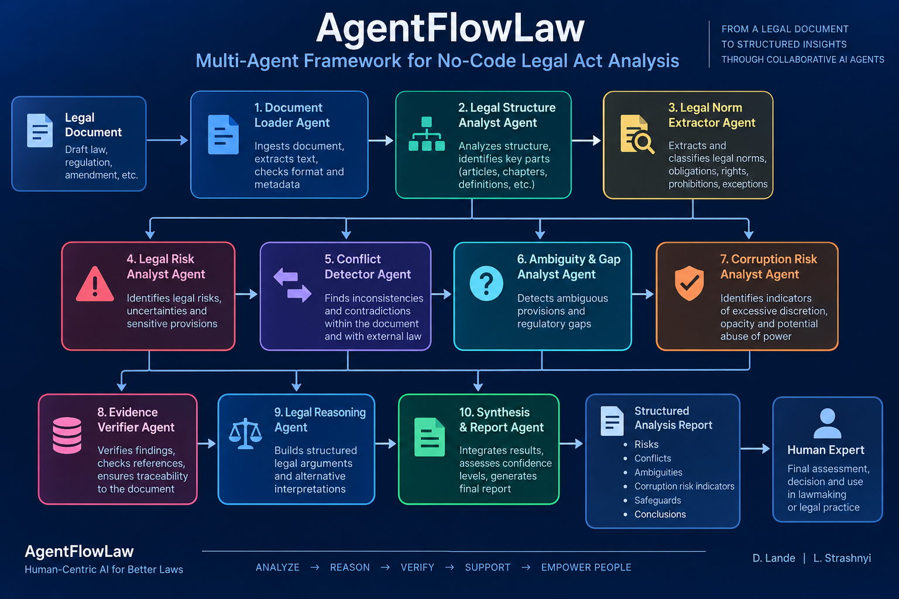

# AgentFlowLaw
No-Code Multi-Agent Framework for Legal Act Analysis

# AgentFlowLaw

## A No-Code Multi-Agent Framework for Legal Act Analysis

**AgentFlowLaw** is a domain-specific no-code framework for designing and executing structured multi-agent procedures for the analysis of legal and regulatory documents using Large Language Models (LLMs).


AgentFlowLaw extends the general-purpose **AgentFlow** approach by introducing concepts and mechanisms required specifically for legal analysis, including legal context, jurisdiction, temporal validity of legal norms, normative authority of sources, evidence verification, uncertainty handling, traceability, and human control.

The central idea of AgentFlowLaw is that an LLM should not simply generate an answer to a legal question. Instead, it can be used to generate and execute a structured procedure for obtaining, verifying, tracing, and presenting that answer.

In this sense:

> **AgentFlowLaw does not primarily program the answer to a legal question; it programs the procedure for obtaining, verifying, tracing, and presenting that answer.**

---

## Concept

The basic workflow of AgentFlowLaw can be represented as:

**Legal Task → AgentFlowLaw → Agent Procedure → LLM → Analysis Result**

A legal task formulated in natural language is transformed into a structured multi-agent procedure.

The generated procedure defines:

- the legal task and its context;
- the specialized agents required for the task;
- the functions and responsibilities of each agent;
- sequential and parallel execution paths;
- information exchange between agents;
- legal source retrieval and verification;
- jurisdiction and temporal validity checks;
- detection of conflicts, ambiguities, gaps, and risks;
- uncertainty handling;
- verification and re-analysis procedures;
- traceability requirements;
- the structure of the final analytical report;
- points where human expert review is required.

Thus, the object of no-code programming is not conventional software code, but the **logic and procedure of legal analysis**.

---

## From AgentFlow to AgentFlowLaw

AgentFlowLaw is based on the general-purpose **AgentFlow** framework.

AgentFlow provides a structured natural-language approach to no-code agent programming and supports logical primitives such as:

- `Condition`
- `Loop`
- `Function`
- `Label`
- `Goto`

It also provides mechanisms for defining agent roles, states, logic, communication, sequential execution, parallel execution, and multi-agent interaction.

AgentFlowLaw preserves these general mechanisms while introducing legal-domain-specific components.

Conceptually:

**AgentFlowLaw = AgentFlow + Legal Context + Legal Sources + Legal Verification + Traceability + Human Control**

---

## Legal-Specific Components

AgentFlowLaw introduces explicit support for the properties of legal information that are not mandatory in a general-purpose agent framework.

These include:

### Legal Context

The procedure explicitly defines the legal context in which the analysis is performed.

### Jurisdiction

Legal conclusions must be associated with the relevant jurisdiction. If the jurisdiction cannot be determined reliably, this uncertainty must be preserved.

### Temporal Validity

The framework supports verification of whether a legal norm or source is valid at the relevant point in time.

### Normative Authority

Legal sources may have different normative status and authority. These relationships should be considered when legal conclusions are generated and verified.

### Legal Sources

Significant legal claims should be linked to identifiable legal norms and sources.

### Evidence

Analytical conclusions should be supported by an explicit evidence base rather than generated solely from the internal knowledge of an LLM.

### Uncertainty

Uncertainty is treated as a legitimate analytical result.

If the available evidence is insufficient, the framework requires the procedure to preserve this state rather than replace it with a plausible but unsupported conclusion.

### Traceability

For significant legal conclusions, AgentFlowLaw supports the following traceability chain:

**Conclusion → Argument → Legal Norm → Source**

### Human Control

AgentFlowLaw is designed to support legal analysis rather than replace legally significant human decision-making.

The final legal assessment remains the responsibility of a human expert.

---

## Multi-Agent Architecture

AgentFlowLaw does not require a fixed set of agents.

The composition of the multi-agent system is generated dynamically according to the legal task.

Depending on the task, the procedure may include specialized agents for:

- document loading and preprocessing;
- structural analysis;
- extraction of legal norms;
- legal source retrieval;
- legal risk analysis;
- conflict detection;
- ambiguity detection;
- gap detection;
- corruption-risk indicator analysis;
- evidence verification;
- validity verification;
- legal reasoning;
- traceability control;
- integration and moderation of results.

A general design principle is:

> **One agent ≈ one principal analytical function.**

This functional decomposition makes intermediate results easier to inspect, verify, and reproduce.

---

## Sequential and Parallel Analysis

AgentFlowLaw supports both sequential and parallel execution.

Operations that depend on previous results are performed sequentially, while independent analytical tasks may be executed in parallel.

For example, after the legal document has been structured and the relevant legal context has been established, different agents may independently analyze:

- legal risks;
- legal conflicts;
- ambiguities and gaps;
- corruption-risk indicators.

Their results are subsequently verified and integrated.

AgentFlowLaw does not require automatic consensus between agents. Meaningful disagreements or alternative legal interpretations may be preserved as part of the final result.

---

## Verification

Verification is treated as a separate stage of legal analysis.

A typical verification cycle can be represented as:

**Analysis → Source Verification → Validity Check → Conflict Check → Argument Verification**

If a result cannot be sufficiently supported, the procedure may return to an earlier analytical stage.

Unresolved issues are not automatically converted into definitive conclusions. They remain explicitly identified in the final analytical output.

---

## Human-in-the-Loop Principle

AgentFlowLaw follows a human-in-the-loop approach.

The framework may assist in:

- identifying relevant legal norms;
- detecting potential conflicts;
- identifying ambiguities and gaps;
- identifying legal and procedural risks;
- identifying indicators of potential corruption risks;
- comparing alternative interpretations;
- verifying supporting sources;
- constructing legal arguments;
- preparing a structured analytical report.

However, the framework does not treat an automatically generated result as a final legal decision.

In particular, an identified risk is not automatically interpreted as a violation, a possible contradiction is not automatically treated as an established legal conflict, and discretionary authority is not automatically interpreted as corruption.

Final legal qualification and legally significant decisions remain with the human expert.

---

## Repository Structure

The repository is dedicated to the description, development, and experimental evaluation of the **AgentFlowLaw** framework.

The main framework is provided in the:

`FRAMEWORK/`

directory.

The repository may include the following structure:

```text
AgentFlowLaw/
│
├── README.md
│
├── FRAMEWORK/
│   └── README.md
│
├── EXAMPLES/
│   └── README.md
│
└── PROMPTS/
    └── README.md
